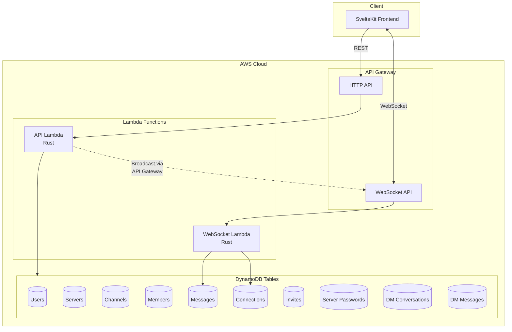
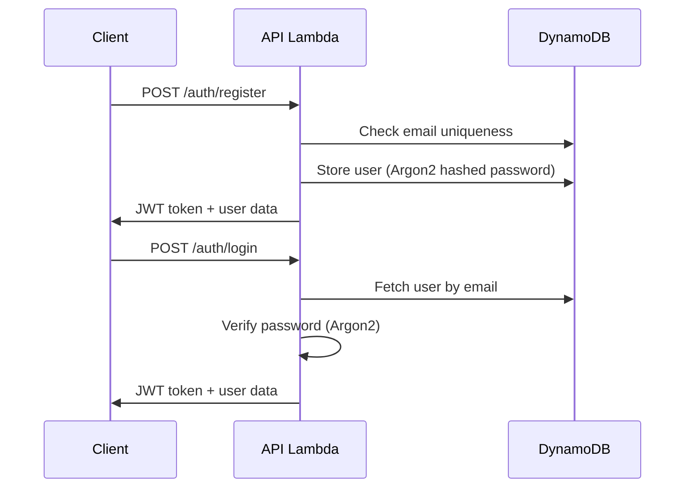
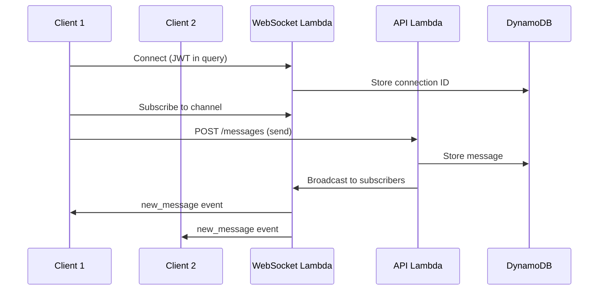
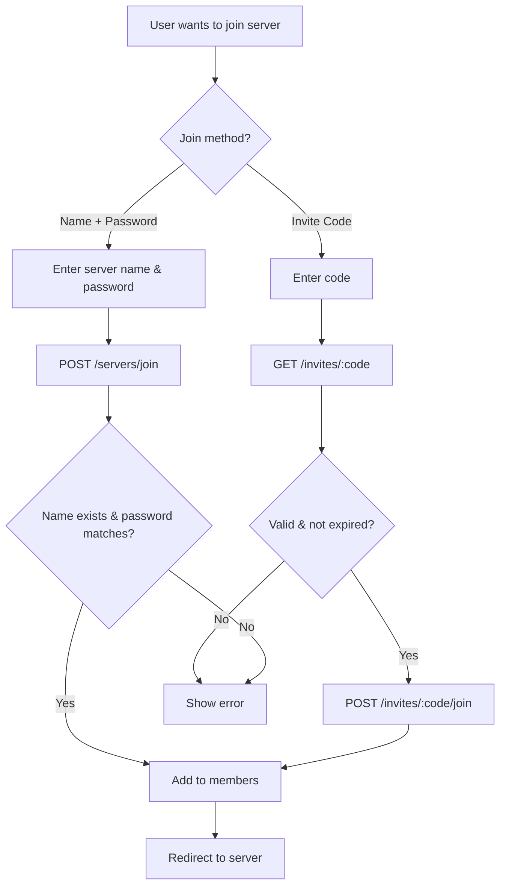

# Agorusta - Project Design

## System Design Diagram



## Requirements

### Functional Requirements

- User registration and authentication with JWT tokens
- Server creation with unique names
- Server joining via invite codes or name+password
- Text channels within servers
- Real-time messaging in channels
- Direct messages between users
- User search for starting DM conversations
- Invite code management (expiration, max uses)
- Server password management (multiple passwords, expiration)

### Non-Functional Requirements

- **Scalability**: Serverless architecture scales automatically with demand
- **Cost-effective**: Pay-per-use model ideal for solo dev/small user base
- **Low latency**: WebSocket connections for real-time message delivery
- **Zero ops**: No servers to manage, patch, or maintain
- **High availability**: Managed AWS services provide built-in redundancy

## High-Level Design

The system uses a decoupled architecture with clear separation between frontend and backend:

**Frontend**: SvelteKit application with TypeScript, using Svelte 5 runes for reactive state management. Communicates via REST API for CRUD operations and WebSocket for real-time updates.

**Backend**: Serverless AWS stack with two Rust Lambda functions:
- `api` - Handles all REST endpoints (auth, servers, channels, messages, invites, DMs)
- `websocket` - Manages WebSocket connections, subscriptions, and message broadcasting

## System Components

### Authentication Flow



### Real-time Messaging



### Server Join Flow



## DynamoDB Tables

| Table | Partition Key | Sort Key | GSIs | Purpose |
|-------|---------------|----------|------|---------|
| Users | id | - | email-index, username-index | User accounts |
| Servers | id | - | name-index | Server metadata |
| Channels | server_id | id | - | Text channels |
| Members | server_id | user_id | user-servers-index | Server membership |
| Messages | channel_id | created_at | - | Channel messages |
| Connections | connection_id | - | - | WebSocket connections |
| Invites | code | - | server-invites-index | Invite codes (TTL enabled) |
| ServerPasswords | id | - | server-passwords-index | Server passwords (TTL enabled) |
| DMConversations | id | user_id | user-conversations-index | DM conversation metadata |
| DMMessages | conversation_id | created_at | - | Direct messages |

## Project Structure

```
agorusta/
├── backend/
│   ├── lambdas/
│   │   ├── api/src/
│   │   │   ├── main.rs        # Route definitions
│   │   │   ├── auth.rs        # Authentication logic
│   │   │   ├── servers.rs     # Server CRUD
│   │   │   ├── channels.rs    # Channel CRUD
│   │   │   ├── messages.rs    # Message handling
│   │   │   ├── invites.rs     # Invite codes & passwords
│   │   │   └── dms.rs         # Direct messages
│   │   └── websocket/src/
│   │       └── main.rs        # WebSocket handler
│   └── Cargo.toml             # Rust workspace
├── frontend/
│   └── src/
│       ├── lib/
│       │   ├── api.ts         # API client
│       │   ├── auth.svelte.ts # Auth state
│       │   └── websocket.svelte.ts
│       └── routes/
│           ├── app/           # Authenticated routes
│           │   ├── [serverId]/
│           │   └── dms/
│           └── +page.svelte   # Login/register
├── template.yaml              # AWS SAM template
└── samconfig.toml             # SAM config
```

## API Endpoints

### Authentication
| Method | Path | Description |
|--------|------|-------------|
| POST | /auth/register | Register new user |
| POST | /auth/login | Login user |
| GET | /auth/me | Get current user |

### Servers & Channels
| Method | Path | Description |
|--------|------|-------------|
| GET | /servers | List user's servers |
| POST | /servers | Create server |
| GET | /servers/:id | Get server with channels |
| POST | /servers/:id/channels | Create channel |
| GET | /servers/:id/channels/:cid/messages | Get messages |
| POST | /servers/:id/channels/:cid/messages | Send message |

### Invites & Passwords
| Method | Path | Description |
|--------|------|-------------|
| POST | /servers/:id/invites | Create invite |
| GET | /servers/:id/invites | List invites |
| DELETE | /servers/:id/invites/:code | Delete invite |
| GET | /invites/:code | Get invite info |
| POST | /invites/:code/join | Join via invite |
| POST | /servers/:id/passwords | Create password |
| GET | /servers/:id/passwords | List passwords |
| DELETE | /servers/:id/passwords/:pid | Delete password |
| POST | /servers/join | Join via name+password |

### Direct Messages
| Method | Path | Description |
|--------|------|-------------|
| GET | /users/search | Search users by username |
| GET | /dms | List conversations |
| POST | /dms | Start conversation |
| GET | /dms/:id | Get conversation |
| GET | /dms/:id/messages | Get DM messages |
| POST | /dms/:id/messages | Send DM |

## Cost Estimate

For solo dev or small user base:

| Service | Free Tier | Cost After |
|---------|-----------|------------|
| Lambda | 1M requests/month | $0.20/1M |
| API Gateway (REST) | 1M calls/month | $1/1M |
| API Gateway (WebSocket) | 1M messages | $1/1M |
| DynamoDB | 25 GB storage | $0.25/GB |

**Estimated monthly cost for light usage: $0-5**
